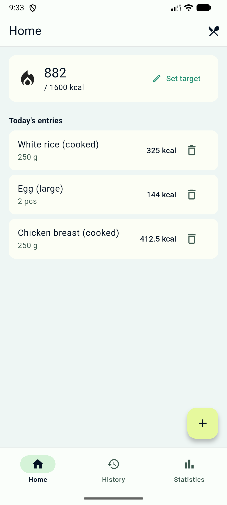
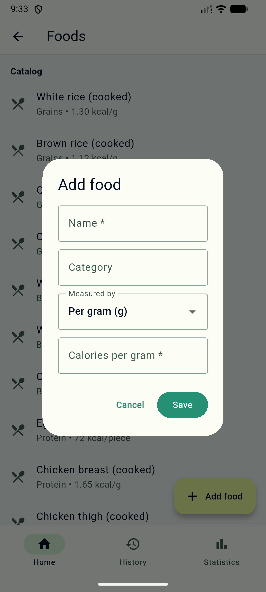
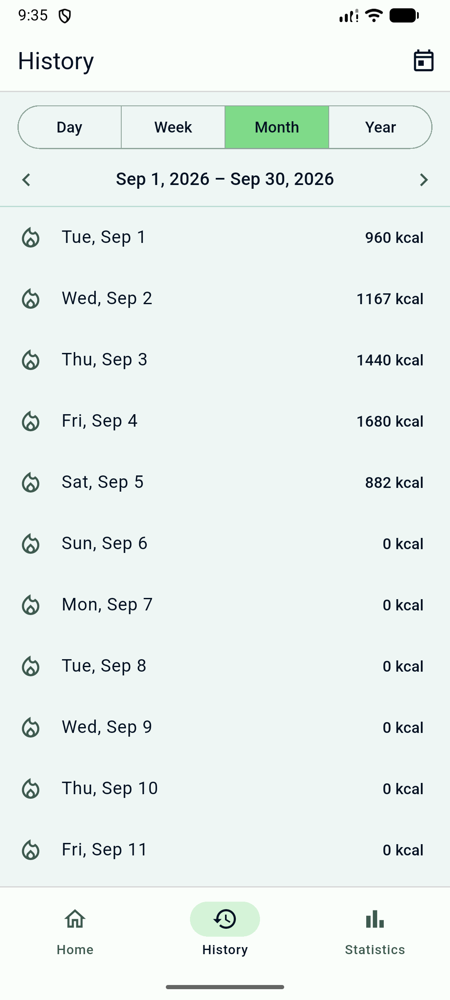
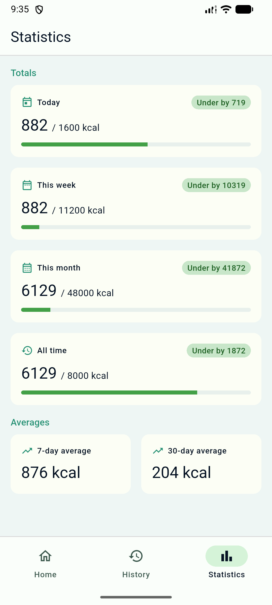

<div align="center">

# 🥗 Calorie Tracker

*A simple, fast, and offline-first calorie tracking application built with Flutter.*


</div>

---


# About

**Calorie Tracker** is a lightweight Flutter application designed to help quickly log daily calorie intake.This project started with the help of Claude Sonnet 5 because I wanted a simple calorie tracker for my own use. Most calorie tracking apps either require a subscription, force you to create an account, or depend on an internet connection. I didn't need all of that—I just wanted something lightweight, fast, and private. With that goal in mind, this project focuses on simplicity, speed, and offline usage. All data is stored locally using SQLite, so the app works entirely offline while keeping your data private and the experience responsive.This repository currently contains **Version 0 (MVP)**,I've used foods items that I eat on a daily basis. A lot of thhings need improvement. I plan to create a proper project with advanced feature later on.


# Features

### Version 0 (Current — MVP)

| Feature | Description |
|---------|-------------|
| **Home** | View today's total calories and a list of all foods logged today |
| **Add Food** | Pick from built-in foods or add custom foods, enter weight/pieces, and see live calorie calculation |
| **History** | Browse every day that has entries. Tap a day to see all meals eaten |
| **Day Detail** | Full breakdown of meals for any selected day with per-item delete |
| **Statistics** | Simple summaries: Today, This Week, This Month, All Time, 7-day & 30-day averages |
| **Offline** | Everything runs locally — no internet required |
| **Persistent** | All data stored in SQLite — survives app restarts |


# Project Structure

```text
lib/
├── main.dart                              # Entry point
├── app.dart                               # MaterialApp + theme + router
│
├── core/                                  # Shared infra (feature-agnostic)
│   ├── database/                          #   SQLite setup (sqflite)
│   ├── di/                                #   Manual DI registrations (get_it)
│   ├── error/                             #   Failure & exception types
│   ├── routing/                           #   GoRouter + shell (bottom nav)
│   ├── storage/                           #   JSON file storage + app paths
│   ├── theme/                             #   AppColors + AppTheme
│   ├── utils/                             #   Calendar helpers (Sat→Fri week)
│   └── widgets/                           #   Empty / Error / Loading views
│
├── features/                              # Feature-first modules
│   ├── diary/                             #   Log food entries
│   ├── food_catalog/                      #   Browse & manage foods
│   ├── history/                           #   Day-by-day calendar history
│   ├── home/                              #   Today view + calorie target
│   └── statistics/                        #   Period stats & target summary
│
└── (each feature follows Clean Architecture)
    ├── data/        datasources / models / repositories
    ├── domain/      entities / repositories / usecases
    └── presentation/ pages / widgets / cubits
```


# Screens

| Home | Add Food | History | Statistics |
|------|----------|----------|------------|
|  |  |  |  |


## Getting Started

### Prerequisites

- [Flutter](https://flutter.dev) SDK (stable channel, 3.x) with Dart 3.x
- An Android device or emulator (the app targets `android/` in this repo)

### Run

```bash
git clone https://github.com/SakibHasanMD/calorie_tracker.git
cd calorie_tracker
flutter pub get
flutter run
```

### Download the app (no build required)

Prefer to just try it? Grab the latest release APK from the [Releases](https://github.com/SakibHasanMD/calorie_tracker/releases) page and install it on your Android device (you may need to enable "Install unknown apps" for your file manager).

### Run tests

```bash
flutter test
```

## License

This project is licensed under the [MIT License](LICENSE).

## Acknowledgments

- Calorie data sourced from standard nutritional references
- Built as a personal project to track my daily calories.

---
